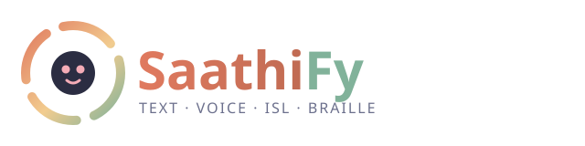
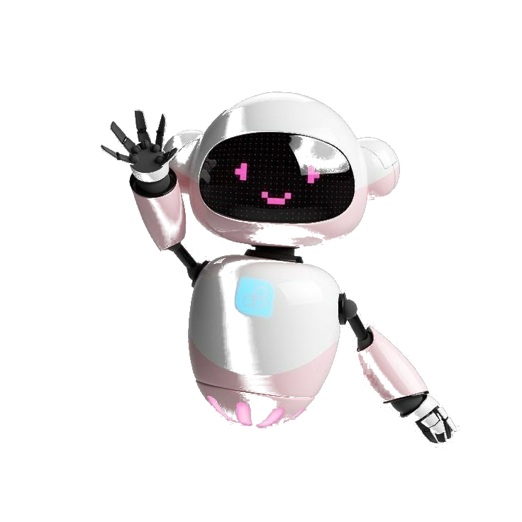
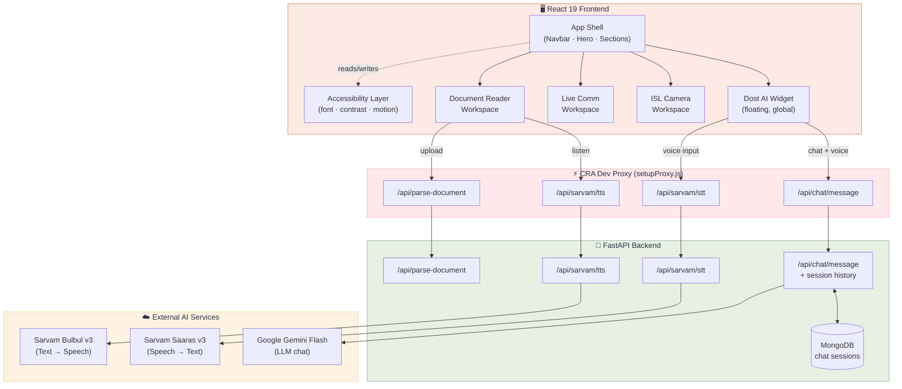
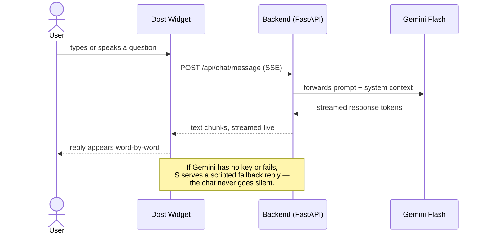
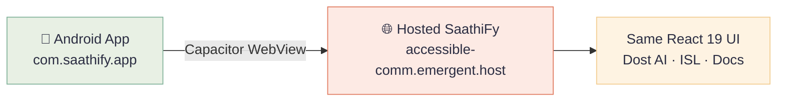

<div align="center">



### Technology that understands how you communicate


An inclusive communication platform for the deaf, hard-of-hearing, and visually impaired — built around a real-time AI companion, Indian Sign Language tools, and accessible document reading.


[](https://react.dev)
[](https://fastapi.tiangolo.com)
[](https://tailwindcss.com)
[](https://www.mongodb.com)
[](https://ai.google.dev)
[](https://sarvam.ai)
[](https://capacitorjs.com)

<br/>

> **📦 This is the Frontend Repository**
>
> The backend (FastAPI server, AI integrations, document parsing) is hosted separately.
>
> [](https://github.com/HarshvardhanKh/saathify-continued)

<br/>

**[Live Demo](#-live-demo) · [Features](#-what-saathify-does) · [Architecture](#️-architecture) · [Android App](#-android-app) · [Roadmap](#️-roadmap) · [FAQ](#-faq) · [Quickstart](#-run-it-locally) · [Team](#-the-team)**

</div>

<br/>

<div align="center">

</div>

<br/>

## 📖 The problem

Over **63 million people in India** live with significant hearing loss, and **millions more** navigate daily life with visual impairment. Most digital tools are built for one way of communicating — typing and listening — and quietly leave everyone else to adapt around them.

**SaathiFy flips that.** One companion, four ways in: **text, voice, Indian Sign Language, and Braille** — so the person adapts nothing, and the product meets them instead.

<br/>

## 🎥 Live demo

<div align="center">


<!-- Optional: drop a recorded screen-capture at .github/assets/demo.gif for an inline preview here -->

*Dost — SaathiFy's AI companion, powered by Gemini Flash*

<br/>


</div>

<br/>

## ✨ What SaathiFy does

<table>
<tr>
<td width="33%" valign="top">

### 💬 Dost AI
A warm, always-on companion that answers questions, teaches ISL vocabulary, and navigates the app for you — in text or voice.

**Try it:** the floating orb, bottom-right, on every page.

</td>
<td width="33%" valign="top">

### 🖐️ ISL Camera
Point your camera and sign — SaathiFy recognizes Indian Sign Language gestures and turns them into text and speech in real time.

**Try it:** *ISL Camera* in the nav bar.

</td>
<td width="33%" valign="top">

### 📖 Document Reader
Upload a `.txt`, `.pdf`, or `.docx` file and consume it three ways: **Read** it, **Listen** to it (Sarvam AI voice), or view it in **Braille**.

**Try it:** *Learn* → *Open Document Reader*.

</td>
</tr>
<tr>
<td width="33%" valign="top">

### 🗣️ Live Communication
A queue-based interpreter workspace for live meetings — build a sentence from signs, then speak it to the room at once.

**Try it:** *Live Comm* in the nav bar.

</td>
<td width="33%" valign="top">

### ♿ Accessibility, built in
Font scaling, dyslexia-friendly typeface, high contrast, reduced motion, and voice navigation — all live, all persistent across the session.

**Try it:** the gear icon, top-right.

</td>
<td width="33%" valign="top">

### 🖥️ Desktop Companion
A concept for an always-on-top ISL avatar that attaches to *any* window on your desktop, not just the browser.

**Status:** designed, not yet built — see below.

</td>
</tr>
</table>

<br/>

> **Built for judges in a hurry:** every claim in this README is checked against the code. The table below tells you exactly what's a live integration versus a working UI ahead of the backend catching up — because a project that's honest about its edges is more trustworthy than one that pretends it has none.

<details>
<summary><b>🔍 Feature reality check — click to expand</b></summary>
<br/>

| Feature | Status | What's actually running |
|---|---|---|
| **Dost AI chat** | 🟢 Live | Real streaming calls to **Gemini Flash** via a FastAPI proxy — falls back to a scripted responder only if no API key is configured |
| **Voice → text (STT)** | 🟢 Live | Real audio uploads to **Sarvam Saaras v3** |
| **Text → voice (TTS)** | 🟢 Live | Real calls to **Sarvam Bulbul v3**, with a browser `speechSynthesis` fallback if the API is unreachable |
| **Document parsing** | 🟢 Live | Real `.txt` / `.pdf` (`pdf-parse`) / `.docx` (`mammoth`) extraction on the server |
| **Braille conversion** | 🟢 Live | Real Grade-1 Unicode Braille transliteration, computed client-side |
| **ISL sign *recognition*** | 🟡 Simulated | The camera workspace runs a scripted confidence-ramp and returns a random sign from a fixed list — the UI/UX is real, the CV model behind it isn't wired up yet |
| **Desktop Companion** | 🟡 Concept | Fully designed download flow and messaging; no desktop binary exists |
| **"Reduce Motion" toggle** | 🔴 Known bug | The switch flips its own UI state but isn't wired to the animations — `Hero` and `Dost AI` instead honor the OS-level `prefers-reduced-motion` setting directly. Tracked, not hidden. |

</details>

<br/>

<details>
<summary><b>🧪 Verify it yourself in 60 seconds — click to expand</b></summary>
<br/>

No need to trust the table above. Every element here has a stable `data-testid` in the DOM if you want to inspect it directly.

| # | Do this | You should see |
|:---:|---|---|
| 1 | Click the floating orb, bottom-right | Chat panel opens, Dost greets you |
| 2 | Type "How do I sign hello?" and send | A real streamed reply, word-by-word (open DevTools → Network → watch `/api/chat/message` stream) |
| 3 | Switch to the **Voice** tab, speak a sentence | Real Sarvam STT transcribes it back as text |
| 4 | Open **Document Reader** → **Listen** | Real Sarvam TTS audio plays (or your browser's own voice, if no Sarvam credits are configured) |
| 5 | Switch to **Braille** tab | Grade-1 Unicode Braille renders live, with a corner notification that slides in |
| 6 | Open **ISL Camera** → **Start Detection** | A confidence bar and a recognized sign appear — this one's the honest simulation, see the table above |
| 7 | Open the gear icon → toggle **Font Size**, **High Contrast**, or **Dyslexia Font** | Applies instantly, site-wide |

</details>

<br/>

## 🏗️ Architecture



<br/>

### How a message actually travels



<br/>

## 📱 Android app

<div align="center">


</div>

SaathiFy also ships as a native Android shell — a thin **Capacitor** wrapper (`saathify-android-shell/`) that loads the same hosted web experience inside a real Android app, so it installs and behaves like a native app while staying backed by the one React frontend.



<details>
<summary><b>🔧 Build it yourself — click to expand</b></summary>
<br/>

**Prerequisites:** Node.js 18+, Android Studio (SDK + platform tools).

```bash
cd saathify-android-shell
npm install
npx cap sync android
npx cap open android      # builds & runs from Android Studio
```

The shell points at the hosted deployment by default (`capacitor.config.json` → `server.url`). Point it at `http://10.0.2.2:3000` (emulator) or your machine's LAN IP instead if you want it loading your **local** `yarn start` dev server.

</details>

<br/>

## 🧰 Tech stack

<table>
<tr>
<td valign="top" width="50%">

**Frontend**
- React 19 + React Router 7
- Tailwind CSS 3 + Radix UI primitives
- Framer Motion (all page/interaction animation)
- CRACO (build config) over Create React App

</td>
<td valign="top" width="50%">

**Backend & AI**
- FastAPI + Motor (async MongoDB driver)
- Google **Gemini Flash** — conversational AI
- Sarvam AI **Bulbul v3 / Saaras v3** — Indian-language TTS/STT
- `pdf-parse` + `mammoth` — document extraction
- **Capacitor 8** — native Android shell around the web app

</td>
</tr>
</table>

<br/>

## 📂 Project structure

<details>
<summary><b>Click to expand the file tree</b></summary>
<br/>

```
Saathify-Frontend/
├── backend/
│   ├── server.py              # FastAPI app — chat, TTS, STT, document parsing
│   └── requirements.txt
│
├── frontend/
│   ├── public/assets/          # Static assets served at /assets/*
│   └── src/
│       ├── components/
│       │   ├── DostAI.js               # The floating AI companion widget
│       │   ├── Navbar.js               # Top nav + accessibility entry point
│       │   ├── Hero.js                 # Landing hero section
│       │   ├── AccessibilityDrawer.js  # Font/contrast/motion settings panel
│       │   ├── ISLRecognitionSection.js
│       │   ├── LiveCommSection.js
│       │   ├── LearningBraille.js
│       │   ├── ISLAvatarShowcase.js
│       │   ├── DesktopAvatar.js        # "Coming soon" desktop concept
│       │   ├── workspaces/
│       │   │   ├── ISLCameraWorkspace.js       # Sign recognition UI
│       │   │   ├── LiveCommWorkspace.js        # Queue-based interpreter
│       │   │   └── DocumentReaderWorkspace.js  # Read / Listen / Braille
│       │   └── ui/                     # Radix-based design system primitives
│       ├── setupProxy.js       # Dev-server proxy → backend AI routes
│       └── App.js              # Root shell, routing, global a11y state
│
├── saathify-android-shell/     # Capacitor wrapper — SaathiFy as a native Android app
│   ├── android/                 # Generated Android Studio project
│   ├── www/index.html           # Capacitor entry point
│   └── capacitor.config.json    # Points the shell at the hosted web app
│
└── README.md                   # You are here
```

</details>

<br/>

## 🗺️ Roadmap

- [x] Gemini-powered Dost AI chat with streaming responses
- [x] Sarvam AI text-to-speech and speech-to-text
- [x] Document Reader — Read / Listen / Braille, from `.txt` / `.pdf` / `.docx`
- [x] Full accessibility settings (font scale, contrast, dyslexia font, voice nav)
- [x] Native Android shell via Capacitor
- [ ] Wire the "Reduce Motion" toggle to the app's actual animations *(see the reality-check table above)*
- [ ] Replace ISL Camera's simulated recognition with a real gesture-classification model
- [ ] Ship the Desktop Companion as an installable app
- [ ] Multi-language support beyond English/Hindi for Dost AI

<br/>

## ❓ FAQ

<details>
<summary><b>Does this actually need API keys to demo?</b></summary>
<br/>
No. Every AI-backed feature has a graceful fallback — Dost AI serves a scripted (but genuinely useful) response, and Document Reader's Listen tab falls back to your browser's own text-to-speech engine. Add <code>GEMINI_API_KEY</code> and <code>SARVAM_API_KEY</code> to unlock the real AI voices and reasoning.
</details>

<details>
<summary><b>Why is ISL sign recognition simulated?</b></summary>
<br/>
Because we'd rather ship an honest, well-designed UI around a real feature that's still in progress than fake a camera-based ML model in a demo. The interaction flow, confidence UI, and suggestion system are all real and ready for a model to be dropped in behind them.
</details>

<details>
<summary><b>Is this accessible for screen readers, not just visually?</b></summary>
<br/>
The UI uses semantic HTML, ARIA roles on interactive elements (dialogs, switches, buttons), and keyboard shortcuts (<kbd>Esc</kbd> to close any overlay). It hasn't been audited with a screen reader end-to-end — that's an open item, not a claim we're making here.
</details>

<br/>

## 🚀 Run it locally

<details>
<summary><b>Click to expand setup instructions</b></summary>
<br/>

**Prerequisites:** Node.js 18+, Python 3.10+, a MongoDB connection string.

```bash
# 1. Clone
git clone https://github.com/DISHA7-debug/Saathify-Frontend.git
cd Saathify-Frontend

# 2. Frontend
cd frontend
yarn install        # or: npm install --legacy-peer-deps
```

Create `frontend/.env`:
```env
GEMINI_API_KEY=your_gemini_key_here
SARVAM_API_KEY=your_sarvam_key_here
```

```bash
yarn start           # → http://localhost:3000
```

**Backend (optional — the dev server proxies these routes itself):**
```bash
cd ../backend
pip install -r requirements.txt
```

Create `backend/.env`:
```env
MONGO_URL=your_mongodb_connection_string
GEMINI_API_KEY=your_gemini_key_here
SARVAM_API_KEY=your_sarvam_key_here
```

```bash
uvicorn server:app --reload --port 8001
```

> No API keys? The app still runs — Dost falls back to a scripted responder and Listen falls back to your browser's built-in voice, so nothing breaks demoing without credentials.

</details>

<br/>

## 👥 The team

<div align="center">

| 🧑‍💻 | 🧑‍💻 | 🧑‍💻 |
|:---:|:---:|:---:|
| **Piyush** | **Disha** | **Harshvardhan** |

*Built together, for everyone who's ever had to adapt to a tool instead of the other way around.*

</div>

<br/>

<div align="center">


**SaathiFy** — *Learn. Grow. Belong.*

[⬆ Back to top](#)


</div>
</content>
